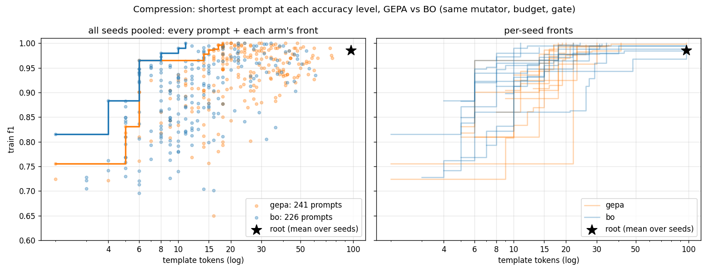

# Compression v2: GEPA vs BO, 12 seeds x 2,000 rollouts, train 100 (Nova Micro / Lite reflector, $0.41)

Second run of the constrained compression comparison (BACKLOG 4b), after the maiden run
(`../2026-09-11-compression-gepa-vs-bo/`) showed that a 30-example train set and a 3-example gate left
selection with almost nothing to decide. **The readout is `fronts.png`**: template tokens vs train F1 for
every prompt each arm fully evaluated, with each arm's non-dominated front. A user with an accuracy bar
reads the shortest prompt at that bar off the graph; an empty region means the search found nothing there.

## Setup (what changed vs the maiden run in bold)

- `tasks/compression` synthetic passages (`generate_dataset(340, seed=0)`); per seed **100 train** / 200 held-out.
  Root 97 template tokens, train F1 0.967-1.0.
- Objective: minimise `template_tokens` s.t. train F1 >= floor; floor = root F1 - 0.15, +0.02 **every 330
  rollouts**, capped at root F1 - 0.05. Same in both arms; re-scored on every move; no penalty.
- Mutator: `ReflectiveExpander` + `COMPRESS_REFLECT_PROMPT`, Nova Lite at temperature 1.0, **5-example**
  minibatch of traces (failures first). Gate: constrained order on the **5-example** minibatch.
- gepa: Pareto pool on per-example F1, sample ∝ wins, 1 child/round. bo: EI over candidates (Titan V2
  embeddings, GPR), value = best child's gain (tokens saved if feasible else 0), 3 children, surrogate keeps 1.
- **2,000 rollouts** per arm-seed, **12 seeds**. 24 runs, 3-4 min each, sequential; per-arm-seed caches.
  Spend $0.30 + $0.10 after a resume (bug below). Harness `experiments/live_compare/compress.py`;
  analysis `analyze_compress.py` (`analysis.md`, `analysis.png`) and `front_plot.py` (`fronts.png`).

## Result

**Pooled fronts (left panel):** BO's front lies left of GEPA's at every accuracy level from 0.80 to 1.0 -
0.965 at 6 tokens vs 14; 1.0 at 11 tokens vs 17. (Caveat: pooling mixes 12 train splits whose root F1
ranges 0.967-1.0, so the y-axis is a slightly different yardstick per point.)

**Per seed, shortest candidate with train F1 >= root F1 - gap** (`analysis.md`, paired by seed):

| gap | gepa tokens | bo tokens | paired gepa-bo | BO shorter | union-front regret gepa / bo |
|---|---|---|---|---|---|
| 0.00 | 26.3 ± 6.6 | 52.7 ± 11.5 | -26.3 ± 13.8 | 3/12 | 1.6 / 27.9 |
| 0.02 | 18.8 ± 1.3 | 19.8 ± 3.4 | -1.1 ± 3.6 | 4/12 | 4.7 / 5.8 |
| 0.05 | 15.8 ± 1.3 | **12.0 ± 1.8** | **+3.8 ± 2.0** | **8/12** | 6.5 / 2.7 |
| 0.10 | 12.3 ± 1.4 | **8.9 ± 1.6** | +3.4 ± 2.2 | 9/12 (1 tie) | 5.2 / 1.8 |

- In the region the floor pointed the search at (gap 0.05-0.10): BO ~3.5 tokens shorter, ~1.7-1.9 SE,
  8-9 of 12 seeds. Up from 7/9 at the 9-seed mark; consistent direction, modest size.
- At the strict end (gap 0.00-0.02) the per-seed averages favour GEPA, driven by seeds where BO never
  fully evaluated an accurate short prompt (its value function gives an accurate-but-not-shorter child
  zero gain, so it does not go back for them; GEPA's pool keeps per-example winners alive regardless of
  length). Pooled, BO still has the shortest prompt at 1.0 - but from 3 seeds, not 12.
- Held-out (200 per seed, root and final best only): gepa 0.951, bo 0.941; both below the root's ~0.98.
  Shortest-feasible prompts sit at the floor and lose 3-8 pts held-out in both arms.
- **Rollout accounting:** GEPA spent 49% of its rollouts on full evaluations that did not advance its
  (tokens, F1) front; BO 35% (11.7 of 18.8 full evals advanced the front vs 10.1 of 20.1). The gate now
  rejects 30-55% of children (was 10-20%), so selection had ~20 real decisions per run and the surrogate
  pre-screen is where BO's edge shows: fewer wasted full evaluations.

## What it says about the hypothesis

"Fitness is not the same as being a good generator of children": at the target the search was given, an
acquisition over ancestor-attributed value plus a surrogate child screen found shorter prompts than
sampling parents ∝ per-example wins, with the same mutator, gate and budget. The flip side is equally
visible: a scalar value tied to one threshold makes BO indifferent to the rest of the front, while the
Pareto pool hedges across it for free. A user who cannot fix the bar in advance wants the whole front,
and the graph is the deliverable, not a row.

## Follow-ups (in order)

1. **Front-aware value for BO** - reward a child by the hypervolume it adds to the (tokens, F1) front, or
   EI over the front, instead of tokens-saved-at-the-floor. Same harness, same seeds, same $0.40. This is
   the experiment the strict-end rows ask for.
2. Real data before scaling further: the synthetic generator is six templates over a closed name list
   and Micro reaches 1.0 at 11 tokens. CoNLL-2003 person spans (licence caveat) or Few-NERD `person`
   (CC BY-SA) plug into the same scorer/schema/feedback.
3. Held-out fronts: score every candidate on the seed's 200 held-out (~$0.20 for 24 runs) so the graph
   can be drawn on unseen data and the train-floor winner's curse quantified.
4. Parallelise runs in the harness (independent arm-seeds; ~25 min instead of 90).

## Bugs found by this run

- Lite wrote a template with a bare `{}`; it passed the placeholder check and crashed the run at render
  (`IndexError`) after seed 8. `Prompt` now rejects positional fields at construction; expander drops such
  variants. Seeds 9-11 were run in a second process (dollar meter restarted; totals above are summed).
- Occasional `ResourceNotFoundException: Inference Profile ARN not found` from Bedrock on single calls
  (transient, counted as failed examples = 0). A retry on that error would be cheap.
