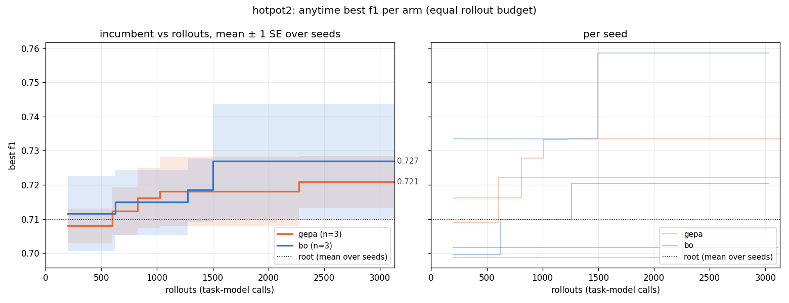
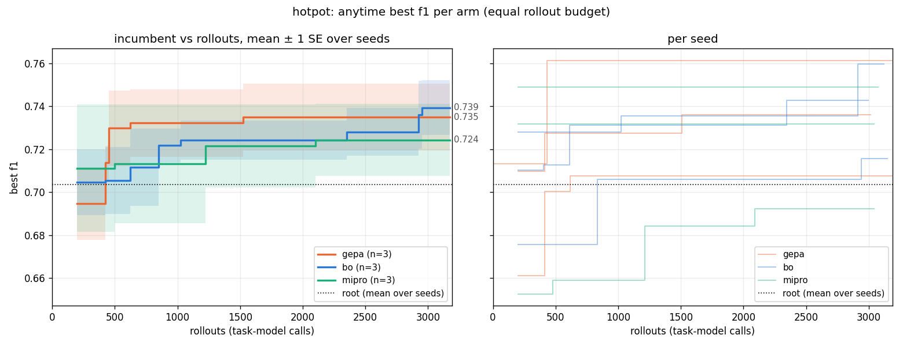

# HotpotQA (distractor): GEPA vs BO vs 0-shot MIPRO, 3 seeds x 3,000 rollouts, train 200 (Nova Micro / Lite reflector, $6.5 total)

First 25% of a planned 12-seed comparison (BACKLOG 4c), run to the pause point to answer "is there anything to
find?" before spending the rest. Two passes: the original phase 1 (all three arms, $2.56), whose gepa/bo rows
turned out to be contaminated by a mutator artefact, and a **clean re-run of gepa and bo on three seeds after the
fix ($1.4, `rerun_clean/`)**, which stopped the experiment: **with the artefact removed, neither arm finds a prompt
that beats the root on held-out data. HotpotQA-distractor on Nova Micro, from this root, is flat** - the
IFBench outcome, reached this time for $4 instead of the planned $12 because of the pause.

## Clean result (`rerun_clean/`, the one to cite)

| seed | arm | root train | best train | Δ train | root held | best held | Δ held | depth of best | accepted / gated |
|---|---|---|---|---|---|---|---|---|---|
| 0 | gepa | 0.716 | 0.733 | +0.017 | 0.700 | 0.688 | -0.012 | 2 | 14/40 |
| 0 | bo | 0.733 | 0.759 | +0.025 | 0.697 | 0.698 | +0.001 | 1 | 13/59 |
| 4 | gepa | 0.699 | 0.707 | +0.008 | 0.696 | 0.667 | -0.029 | 3 | 14/27 |
| 4 | bo | 0.700 | 0.720 | +0.021 | 0.723 | 0.718 | -0.005 | 4 | 13/59 |
| 8 | gepa | 0.709 | 0.722 | +0.013 | 0.684 | 0.674 | -0.010 | 1 | 14/38 |
| 8 | bo | 0.702 | 0.702 | +0.000 | 0.692 | 0.692 | +0.000 | 0 (root) | 14/36 |

gepa: Δ train +0.013 ± 0.003, Δ held **-0.017 ± 0.006**. bo: Δ train +0.015 ± 0.008, Δ held **-0.001 ± 0.002**.

- Train gains of +1-2.5 pts are what selecting the max of ~15 candidates measured on 200 rows produces from
  noise alone (per-example F1 sd 0.4 -> SE 0.028 per candidate; the expected max of 15 equal candidates is a
  few pts above the root even after accounting for pairing). Held-out confirms: 0 or negative in 6/6 runs.
- The gate accepted 13-14 children per run in both arms (as in the contaminated runs), so the search *was*
  active - it just found paraphrases of equal quality. bo's best on seed 8 is the root itself.
- gepa vs bo on held-out: bo is less negative in 3/3 seeds (-0.012/+0.001, -0.029/-0.005, -0.010/0.000) - i.e. BO
  overfits the train set less, the "robust to evaluation noise" property from the synthetic ladder. On a flat
  landscape that is all there is to see, and it is a small effect at n=3.

## Temperature-0 re-run (`rerun_t0/`, 2026-09-16, $2.4 incl. pilot) - the final word

Every live run up to here evaluated at Nova's service default temperature 0.7 (`ModelConfig.temperature=None`
sends nothing). Re-run of gepa and bo on seeds 0-2 with rollouts pinned to temperature 0 (`--eval-temperature`,
now the harness default), plus the hand-variant pilot at temperature 0.

| seed | arm | root train | best train | Δ train | root held | best held | Δ held | depth of best | accepted / gated |
|---|---|---|---|---|---|---|---|---|---|
| 0 | gepa | 0.730 | 0.734 | +0.004 | 0.699 | 0.698 | -0.001 | 2 | 13/58 |
| 0 | bo | 0.734 | 0.734 | +0.000 | 0.703 | 0.703 | +0.000 | 0 (root) | 14/48 |
| 1 | gepa | 0.750 | 0.750 | +0.000 | 0.661 | 0.661 | +0.000 | 0 (root) | 13/56 |
| 1 | bo | 0.713 | 0.713 | +0.000 | 0.663 | 0.663 | +0.000 | 0 (root) | 14/39 |
| 2 | gepa | 0.680 | 0.692 | +0.011 | 0.717 | 0.707 | -0.010 | 4 | 14/47 |
| 2 | bo | 0.676 | 0.693 | +0.017 | 0.696 | 0.688 | -0.008 | 1 | 14/50 |

gepa: Δ train +0.005 ± 0.003, Δ held -0.004 ± 0.003. bo: Δ train +0.006 ± 0.006, Δ held -0.003 ± 0.003.
In 3 of 6 runs the best candidate *is the root*; 13-14 children per run reached the full 200 rows and every one of
them scored at or below it (candidate range e.g. 0.597-0.734 around a root of 0.730). Flat, from both arms, at
both temperatures.

**Pilot at temperature 0** (`pilot_t0.md`): root 0.715; minimal -0.005 ± 0.014, cot -0.009 ± 0.018, span_rules
-0.014 ± 0.017, persona -0.016 ± 0.015, two_hop -0.031 ± 0.017. The "-5 to -8 pts, all significant" at
temperature 0.7 was sampling noise on top of a 1-3 pt real spread: six quite different prompts sit in a 3-pt band.

**Temperature 0 is not deterministic on Bedrock Nova Micro.** The same root on the same 200 rows, evaluated once
per arm: different output text on 109 / 119 / 116 of 200 rows (seeds 0/1/2), different F1 on 12 / 19 / 22, and a
3.7-pt gap on seed 1 (0.750 vs 0.713). There is an irreducible ~1-4 pt noise floor per 200-row score that no
sampling setting removes; only repeats or a noise-aware surrogate can. (Completions are cached, so a single run
never sees its own variance - only cross-arm root comparisons expose it.)

The rest of this note is the original phase 1, kept because the pilot and the MIPRO rows are valid and because
the artefact is instructive.

---

## Headroom pilot (`pilot.md`, `pilot_reasoning.md`, $0.15)

Root + 5 hand-written variants x 300 rows. Root F1 0.732 (EM 0.587); every hand variant is *worse* by 5-8 pts
(paired SE 0.016, all significant). With a `reasoning` field in the answer schema the root is unchanged (0.737)
and the two-hop variant gains 5 pts but stays below root. Landscape has real structure (8-pt spread) and the root
is a strong local optimum - a fair test of "can an optimizer find anything above a good root". Run with the
reasoning schema.

## Setup

- `tasks/hotpotqa`: 600-row seeded sample of the distractor dev set (10 paragraphs, ~1.5k tokens/example);
  per seed 200 train / 300 held-out. Objective: maximise train F1 (official normalisation). No constraint.
- Arms at 3,000 rollouts each (root eval included), same root, split, reflector (Lite, temperature 1.0), minibatch 5:
  gepa (Pareto pool, sample ∝ wins, 1 child/round, gate = child beats parent on the minibatch); bo (EI over
  candidates, value = best child F1, 3 children, surrogate keeps 1 for the minibatch); mipro (16 grounded
  candidates proposed once from the root, categorical TPE trials on minibatches of 10, full eval of the
  best-by-mean every 10 trials; no feedback, no tree growth). Harness `experiments/live_compare/hotpot.py`.

## Original phase-1 result (`summary.md`, `trajectory.png`) - gepa/bo rows CONTAMINATED, see below

| arm | train gain over root | held-out gain over root | best held F1 (mean ± SE, same rows per seed) |
|---|---|---|---|
| gepa | +0.040 ± 0.007 | +0.048 ± 0.021 | 0.730 ± 0.024 |
| bo | +0.035 ± 0.003 | +0.038 ± 0.007 | 0.737 ± 0.005 |
| mipro | +0.013 ± 0.013 | +0.002 ± 0.002 | 0.698 ± 0.016 |

- (Superseded.) Both reflective arms appeared to find prompts above the root on train *and* held-out in 3/3
  seeds (held +2.5 to +9 pts). The clean re-run shows this was the doubled-context artefact, not the instruction.
- **0-shot MIPRO finds nothing** in 2/3 seeds (0 of 16 grounded candidates beat the root; the +0.039 train gain
  on seed 2 is held +0.006). Consistent with the paper's MIPROv2 ~0 on HotpotQA and with the pilot: the root
  is already better than what a proposer without execution feedback writes.
- gepa vs bo: 1 seed each way and a tie; paired best-held gepa-bo +0.027 / -0.042 / -0.005. Nothing to
  conclude at n=3 - and see the artefact below.
- **Noise floor:** the same root on the same 200 train rows scored 0.713 / 0.710 / 0.749 across the three arms
  of seed 0 (Nova Micro is nondeterministic), and 0.676 / 0.699 / 0.710 on the same 300 held-out rows. ~2-4 pts
  of any per-seed number is model sampling noise; "gain over root" should be read against that, and best-held
  compared within a seed across arms is the cleaner readout.

## Artefact found (fixed in `bpto/ops.py`, tests added)

Nova Lite sometimes returns *two templates glued into one JSON string* with `<prompt>` tags between them. The
expander only stripped leading/trailing tags, so the glued string became one template that renders `{context}`
(1.5k tokens) and `{question}` twice. 5 of the 6 gepa/bo "best" prompts are such doubles, and they beat the best
clean prompt in the same run by 1-2.5 pts train F1 - a doubled-context effect, not a better instruction. The
best *clean* prompts in those runs still beat the root on train (gepa +2.7 / +2.6 / +3.9, bo +2.1 / +0.8 / +3.0),
which at the time looked like surviving headroom; the clean re-run shows train gains of that size are noise plus
selection, with nothing on held-out. Fix: split returned strings on
`<prompt>` tags and require each placeholder exactly once. Also fixed: Lite's raw newlines inside JSON strings
(`json.loads(strict=False)` fallback in the Bedrock parser) which had been discarding ~8% of reflections.

## What to take from it

1. HotpotQA-distractor joins IFBench as a flat landscape for single-prompt search on Nova Micro: a competent root
   is already at the model's ceiling; hand variants lose 5-8 pts, reflective rewrites tie, a feedback-free proposer
   ties. The GEPA paper's +20 on HotpotQA is a 3-module retrieval program on Qwen3-8B - not this task.
2. The pause paid for itself: $4.1 spent (pilot 0.15, phase 1 2.56, clean re-run 1.4) instead of $12.
3. A doubled `{context}` was worth +2-9 pts held-out - more than any instruction change. That is a real effect
   (re-reading the passages), but it is a *format* lever, not a prompt-search result; the expander now forbids it.
   If that lever is wanted, it should be an explicit op, not an accident.
4. Selection-strategy comparisons need a task where the mutator can actually move the score. Compression remains
   the only live task where that is true; a stronger task model (Lite/Pro) on HotpotQA might not be flat, but the
   research question is selection, not model size.
5. Evaluation noise on Nova Micro is ~1-4 pts per 200-row score even at temperature 0. Any future comparison
   must either re-measure incumbents (a child that beats its parent on the full set is evaluated again and must
   beat it again) or feed per-node SE to the surrogate (`BOSelector(noise=...)`); "gain over root" from one
   measurement of each is not a result.
