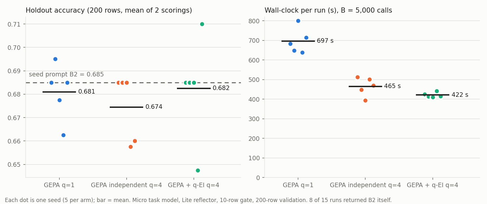

# OSHA SIR: official GEPA vs GEPA + bpto q-EI, equal calls, 5 seeds ($4.6)

2026-09-26. First head-to-head against the **official** GEPA package (`gepa==0.1.4`), not bpto's re-implementation.
Optimizer vs optimizer: same engine, task model, reflector, gate, budget and seed prompt in every arm; the arms
differ only in which parents get expanded (the expand seat). Code: `tasks/osha_sir/`.

**Claim under test** (user): q > 1 competes only on parallelism, and bpto's job is to make q-EI possible; so the
claim is "same accuracy at equal calls, in less wall-clock time".

**Result:** wall-clock **1.65x faster than sequential GEPA** (422 ± 12 s vs 697 ± 59 s) and 10% faster than
GEPA's own parallel mode (465 ± 42 s), at equal calls and cost. Accuracy parity held only trivially: **no arm
improved on the seed prompt** (holdout 0.681 / 0.674 / 0.682 vs B2's 0.685), so this run does not test accuracy
under climbing.



## Setup

- **Data** (`tasks/osha_sir/data.py`, splits in `tasks/osha_sir/data/`): OSHA Severe Injury Reports, full CSV
  (`January2015toNovember2025.zip`), EventDate 2015-2023, non-empty narratives: 88,250 rows. Target = OIICS 2.01
  event major group (the code's first two digits); 2,811 rows coded only at division level or Nonclassifiable
  dropped (no major group); 50 near-duplicate narratives dropped. 12 most frequent groups by official title + Other =
  13 classes. Train / val / holdout 200 each, disjoint, seeded, >= 8 per class, rest proportional; holdout sha256 in
  `manifest.json`.
- **Arms**: the official GEPA engine with its defaults (Pareto candidate selector, strict minibatch gate, default
  reflection prompt and ``` parser) and three parent-sampling strategies:
  - `q1`: GEPA's default `SingleMutationSampling`.
  - `independent4`: GEPA's own `IndependentSampling(4)` (4 Pareto draws per iteration).
  - `qei4`: `QEISampling(4)` (`tasks/osha_sir/qei_sampling.py`): bpto `BOSelector` unchanged (Titan V2 embeddings,
    PCA 4, PIT targets, per-observation noise, `QEI` joint pick) over every accepted program; target = each
    proposal's estimated full score (parent full + child - parent on the child's minibatch rows) at the parent's input,
    read from GEPA's own trace. GEPA's sampler during warmup (2 iterations). Always 4 proposals per iteration.
- **Models**: task Nova Micro (temperature 0, max 1,024 out), reflector Nova Lite (temperature 1.0), both through
  bpto `BedrockClient`s (`official_gepa.py` bridges GEPA's sync engine to the async clients; one cache, budget and
  semaphore path for all arms).
- **Budget**: B = 5,000 GEPA metric calls, GEPA's own unit (one per row evaluated, cached or not; the engine charges
  validation passes per row whatever `num_metric_calls` says). Minibatch 10 train rows, full set 200 val rows. The
  engine checks B between iterations: overshoot 10-420 calls (one val pass).
- **Seed prompt B2**: written by Claude Opus 5.5 on Bedrock from "Write a prompt that classifies OSHA severe injury
  narratives into these event categories: [labels]. Output only the category." (+ slot instruction); 6,034 chars,
  near-OIICS definitions. B1 (GPT-6 Sol, same meta-prompt): 1,200 chars. B0: bare label list.
- **Concurrency**: 16 in flight per run; per seed the three arms ran at the same time (same Bedrock contention),
  seeds in sequence. One task cache per run, so no run is served another's calls.
- **Holdout**: every run's chosen prompt (GEPA's best on val) and the reference prompts, 200 rows, scored twice with
  fresh calls (Micro at temperature 0 flips 0-7 of 200 predictions between scorings).

## Results

| arm | holdout acc (mean ± sd, 5 seeds) | best val | wall-clock | rewrites | gate passed | $ / run |
|---|---|---|---|---|---|---|
| GEPA q=1 | 0.681 ± .011 | 0.735 | 697 ± 59 s | 67 | 17.6 | 0.25 |
| GEPA independent q=4 | 0.675 ± .013 | 0.741 | 465 ± 42 s | 83 | 16.8 | 0.23 |
| GEPA + q-EI q=4 | 0.683 ± .020 | 0.738 | 422 ± 12 s | 68 | 17.6 | 0.21 |

Per run: `table.md`, `evaluations.jsonl`. Reference prompts on the holdout (val in `reference_scores.json`):

| prompt | holdout acc | macro-F1 | input tokens |
|---|---|---|---|
| B0 control (label list) | 0.563 | 0.50 | 131 |
| B1 (GPT-6 Sol) | 0.540 | 0.47 | 280 |
| **B2 (Opus 5.5), the seed** | **0.685** | 0.63 | 1,267 |
| one-step rewrite of B2, Lite | 0.645 | 0.59 | 861 |
| one-step rewrite of B2, Opus 5.5 | 0.695 | 0.67 | 1,758 |

## Findings

1. **Wall-clock: q-EI q=4 is 1.65x faster than sequential GEPA at equal calls**, with the lowest spread of the three
   (sd 12 s). It also beat GEPA's own `IndependentSampling(4)` by 10%. Cost per run is the same or lower.
2. **Nothing climbed.** 8 of 15 runs returned B2 itself (q1 2, independent 3, q-EI 3). Of the 260 children that
   passed the gate and got a full evaluation, 73 beat their parent on the 200 val rows and 19 beat the seed, but the
   val winners did not transfer: only q-EI seed 4 (0.710) and q1 seed 1 (0.695) finished above B2 on the holdout by
   more than the scoring noise. The 1-2 point arm differences are inside seed-to-seed spread.
3. **Where the budget went.** ~17 of ~70 rewrites per run passed the 10-row strict gate; their 200-row confirmations
   were 64-69% of every arm's calls. Ties on the gate: 18-69 per run. Same for all arms by construction (the gate is
   GEPA's), so it doesn't bias the race, but at this budget it leaves ~15 real proposals' worth of search after the
   confirmations.
4. **A strong one-shot rewrite matched 5,000 calls of search.** Opus 5.5 rewriting B2 once (no data) scored 0.695;
   the best arm mean 0.683. Chaining (one-step first, iterative search after) is the natural framing: the search has
   to add something on top of what one good rewrite gets.
5. **B2 was a hard seed.** Pilot on val: B2 0.74, one-step Opus 0.72, one-step Lite 0.69, B0 0.58, B1 0.54. With
   ~13 points of headroom between B0 and B2 left untested, this run cannot say whether q-EI keeps accuracy parity
   when the search does climb (the synthetic ladder says it needs slightly more calls than q=1 for the same level:
   ~124 vs 103 evaluations at q=4).

## Official GEPA through bpto: what the pre-tests found (`pretest_0a.json`, `pretest_0b_*.json`)

- Offline (mock, $0), 12/12 checks: runs, climbs, same seed -> same run, resume works (does not replay exactly),
  q=4 fans out, transient errors score 0 and continue, `BudgetExceeded` propagates, q-EI leaves warmup with
  non-flat fits (0 flat in 75 live q-EI fits across the 5 seeds) and its joint pick differs from top-q.
- **GEPA's parser** takes the whole reflector reply as the new prompt when there is no ``` block (preamble leaks
  into the prompt). **Reflection errors** are logged and skipped even with `raise_on_exception=True`.
- **GEPA's default reflection prompt does not mention template slots**: rewrites dropped `{narrative}` often
  (130-379 slot-restored evaluations per arm over 5 seeds). The adapter appends the narrative at the end, the same
  for every arm; lineages inherit it.
- **Harness bug found and fixed mid-run** (first launch discarded, ~$0.60): with q > 1, GEPA's epoch sampler gives
  an iteration's tasks chunks i..i+3 and the next iteration i+1..i+4, so a repeated parent meets the same rows and
  builds a byte-identical reflection prompt; bpto's completion cache replayed the old rewrite instead of a fresh
  temperature-1 sample (independent q=4: 26 billed reflections for 72 proposals). The reflector now records to a
  log-only cache and never replays (`LogOnlyCache`); verified 16 proposals = 16 calls.
- Accounting: `count="billed"` (fresh calls as `num_metric_calls`) is a mixed unit in 0.1.4, since the engine charges
  validation per row regardless; the benchmark uses GEPA's own requested-rows unit for every arm.

## Cost

Main runs $3.46; discarded first launch ~$0.60; pre-tests 0b $0.06 (+ $0.02 fix check); pilot $0.06; holdout
scoring ~$0.3; prompt authoring (Opus 5.5, GPT-6 Sol, Lite) under $0.20. **Total ≈ $4.6** (cap $10).

## Not done (paused by the user, 2026-09-26)

Third-party one-shot improvers (anonymised in any public copy), the q=8 arm, the compression arm, and the
B0-seeded race (see BACKLOG).
