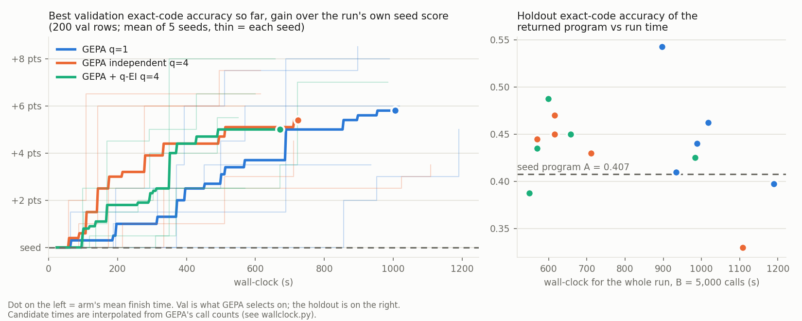

# OSHA detailed OIICS, two-step program: official GEPA vs GEPA + bpto q-EI, equal calls, 5 seeds (~$12.5)

2026-09-27. Follow-up to `2026-09-26-osha-sir-gepa-vs-qei`, where nothing climbed (the seed started near the ceiling), so
"same accuracy in less time" could only be tested trivially. The user's diagnosis was that a one-step, 13-class problem
has too little landscape and the minibatch was too small. This run changes three things: the target is the detailed
four-digit OIICS event code, the program has two steps, and the minibatch is 15. The harness, arms, models, budget
and split sizes are the same. Code: `tasks/osha_oiics/`.

**Result:** this time the search climbs. Every arm gains about 5-6 points of val and 2-4 points of holdout over the
seed program. **Both q=4 arms reach the same val level in about half the wall-clock of q=1.** Averaged over seeds,
q=1 needs about 690 s to reach +4 points, while independent q=4 and q-EI q=4 need about 330 s and 350 s. A full run
takes 1,005 s at q=1, 724 s for independent q=4 and 672 s for q-EI q=4 (1.5x faster than q=1). **On the holdout the
three arms are not separable**: q=1 0.451 ± .051, independent q=4 0.425 ± .049, q-EI 0.437 ± .033, with the seed at
0.407. The seed-to-seed spread (.33-.54) is about five times the gap between the arms. q-EI has the smallest holdout spread.

## Setup

- **Data** (`tasks/osha_oiics/data.py`, splits and `manifest.json` in `tasks/osha_oiics/data/`): the same OSHA SIR CSV,
  2015-2023. Rows are kept only if they fit the two-step form, as fixed before any run. That means a full four-digit
  OIICS 2.01 event code, not "unspecified" (codes ending in 0), and a code with at least 30 rows. That leaves 49,097
  rows, 103 codes and 18 major groups. Train, val and holdout are 200 rows each, disjoint and seeded, with at least 4
  rows per group and the rest in proportion to group size. The most common code is about 10% of the val set.
- **Program** (`tasks/osha_oiics/program.py`):
  - `route` reads {narrative} and picks one of the 18 major groups.
  - `code` reads {narrative}, {group} and {codes} and picks one detailed code in that group. {codes} is the chosen
    group's "code: title" list, a retrieval step that is not optimized. A group with only one code skips the call.
  - GEPA sees only exact-code accuracy. Group accuracy comes from the same calls and is recorded beside it.
  - Each row costs up to 2 Micro calls. GEPA's budget unit is still one per row.
- **Seed programs**:
  - **C0**: bare group and code lists, written by hand, about 480 input tokens per row.
  - **A**: Opus 5.5 on Bedrock wrote both modules from the OIICS titles, about 4,060 input tokens per row.
  - Every arm was seeded with A, which matches the previous race's strong-author seed.
- **Arms**: the same as the 2026-09-26 run: `q1` (GEPA's `SingleMutationSampling`), `independent4`
  (`IndependentSampling(4)`) and `qei4` (`tasks/osha_sir/qei_sampling.py`). The only change is that q-EI now embeds
  both modules' text, as `[route]` and `[code]` in order.
- **Budget and gate**: B = 5,000 GEPA metric calls, minibatch 15 train rows (it was 10), full set 200 val rows.
  Each run had a $1 cap and `Budget(max_calls=12,000)` on Micro. For each seed the three arms ran at the same time;
  the seeds ran one after another.
- **Models**: task Nova Micro (temperature 0), reflector Nova Lite (temperature 1.0), both through bpto `BedrockClient`s.
- **Holdout**: 200 rows. Each run's returned program and both seeds were scored twice with fresh calls.

## Pilot (200 val rows, 2 repeats; before the race)

| seed | exact code | group right (step 1) | code right given group right | step 2 given the gold group |
|---|---|---|---|---|
| C0 | .34 | .57 | .60 | .61 |
| A | .39 | .53 | .74 | .66 |

The headroom was mostly in step 1. Micro sent 22 of 35 group-62 rows ("struck by object") to 63 ("struck against"),
and got 0 of 13 group-27 rows (off-road vehicle incidents) right.

## Results

| arm | holdout code (mean ± sd, 5 seeds) | holdout group | val gain over seed | wall-clock | $ / run |
|---|---|---|---|---|---|
| seed A | 0.407 | 0.653 | - | - | - |
| GEPA q=1 | **0.451 ± .051** | 0.692 | +6.2 ± 1.9 pts | 1005 ± 101 s | 0.41 |
| GEPA independent q=4 | 0.425 ± .049 | 0.678 | +5.6 ± 1.4 | 724 ± 198 s | 0.43 |
| GEPA + q-EI q=4 | 0.437 ± **.033** | 0.667 | +5.9 ± 1.9 | **672 ± 160 s** | 0.39 |

Control C0 scores 0.4125 on the holdout, level with A (0.4075). A's 5-point val lead in the pilot did not hold on
the holdout: A routes better (.65 vs .61) but codes worse given the right group (.62 vs .68). Per-run numbers are in
`table.md` and `evaluations.jsonl`, and the returned programs are in `prompts/`.

## Findings

1. **The search climbs.** The two-step detailed-code task has the landscape that OSHA SIR lacked. All 15 runs
   returned a program other than the seed (the previous race had 7 of 15). Val gains were +3.5 to +9 points and 12
   of 15 runs beat the seed on the holdout. The best run, q=1 seed 3, reached 0.542 on the holdout (+13.5 points).
   The rewrites landed mostly in step 1, as the pilot predicted: holdout group accuracy rose from .65 to .67-.69 on
   average. The returned programs changed route only in 4 runs, code only in 1, and both in 10.
2. **Accuracy against wall-clock (the requested plot): q=4 gets there first.** At 400 s the mean val gain is +2.5
   points for q=1 against +4.4 for both q=4 arms. q=1 matches their final level only after about 700-1,000 s. At
   the finish the three arms are level on val (+5.0 to +5.8 points on the plot's grid), because they spent the same
   calls. **This is the case the value prop needs: a search that climbs, with equal accuracy at equal calls and
   about 1.5x less time to finish.** q-EI and independent q=4 are indistinguishable on time here. q-EI finished
   7% sooner on average, but the spread across seeds swamps that.
3. **The holdout does not separate the arms.** q=1's lead (+1.4 and +2.6 points over q-EI and independent q=4)
   comes largely from one run, seed 3 at 0.542. Without it, q=1 averages 0.428. With 5 seeds, sd ≈ .05 and 200 rows,
   the standard error of each mean is about .02. q-EI has the tightest spread (.033) and no disaster. Independent
   q=4's worst run, seed 4 at 0.330, is the lowest of all 15.
4. **Wordy prompts cost time and accuracy, and that moves wall-clock more than the sampler does.** In three runs
   the lineages drifted to prompts that make Micro reason out loud before answering: q1 s2, independent4 s4 and
   qei4 s2 averaged 144-215 output tokens per call, against 19-92 elsewhere. Those were three of the four slowest
   runs (984-1,190 s). Across all 15 runs, output length correlates with run time at r = .73 and with holdout
   accuracy at r = -.48. They also had the least stable holdout predictions: 39-54 of 200 codes flipped between
   the two scorings, against 6-25 in 11 of the other 12 runs (independent4 s0 also had 52). The arm's wall-clock ranking therefore depends partly on which
   lineages each seed wandered into. Without those three runs: q=1 959 s, independent q=4 628 s, q-EI 594 s. With a
   length or cost term in the objective, this would be a constrained problem (compression); the user decided not to
   pursue that this iteration.
5. **The holdout and val disagree at the 5-point level on single programs.** C0 and A are 5 points apart on val and
   level on the holdout. The returned programs gained about 6 points on val and 3 on the holdout on average. At 200
   rows, per-program comparisons below about 5 points are noise. The arm means need more seeds, not larger splits,
   to separate by 2 points.

## Joint vs decoupled (added 2026-09-27, $4.5)

**Joint** is the main race's q1 arm: one GEPA run rewrites both steps and sees only exact-code accuracy.
**Decoupled** runs two separate GEPA q1 runs per seed, each on its own labels:
- `route` alone, scored on group accuracy;
- `code` alone, handed the gold group and scored on the exact code.

Each decoupled run gets B = 5,000 rows at 1 call per row, so the task calls match the joint run's 5,000 rows × 2 calls
(about 9,800-10,000 requested calls in both). The decoupled side used about 1.7× the reflector calls (508 vs 289 over 5
seeds). The two best components are recombined and scored end-to-end on the holdout, with 2 repeats. The seeds, the
seed program A, the minibatch and the splits are the same as the joint runs (`run.py gepa --step`, `run.py combine`).

| | holdout exact code (5 seeds) | holdout group | code right given group right |
|---|---|---|---|
| seed A | 0.407 | 0.653 | 0.625 |
| joint (main q1) | 0.451 ± **.051** | 0.692 ± .053 | 0.650 |
| decoupled | 0.453 ± **.013** | 0.687 ± .019 | 0.660 |

Per seed, decoupled vs joint: .460/.463, .445/.440, .475/.397, .443/.542, .443/.410.

- **Same mean, a quarter of the spread.** Decoupled optimization matches joint on average. Every seed lands at
  .44-.48, while joint ranges from .40 to .54. Each decoupled half gets a clean signal: step 1 is judged on its own
  label, not only when step 2 also gets the code right. Step 2 is judged on rows where the group is known to be right,
  so a half never rides on its partner's luck. Joint's best run (.542) and its worst (.397) both came from how the
  two steps happened to combine.
- **Joint still learned step 1 as well**, even though step 1 only sees the end-to-end signal: holdout group .692
  against .687. The feedback text tells the route reflector the gold group on every row, so step 1 is not starved of
  signal the way the scalar score alone would suggest.
- Cost: $4.14 for the 10 runs, against $2.04 for the 5 joint q1 runs at the same task calls. The code-only runs'
  prompts are longer, and there were more reflections. Holdout scoring came to $0.34. The estimate was $3.
- **Takeaway for pipelines with intermediate labels (AP, GL, ICD):** decoupling doesn't raise the mean. It makes the
  result predictable, so a single run is enough, whereas a joint run needs several seeds to trust.

## Expand-seat diagnostics (added 2026-09-27, `sampler_diagnostics.py`, $0)

Read from GEPA's own `run_log.json` for every proposal in the main race: the parent, the minibatch rows, and the
parent's and child's scores on them.

| per run, mean of 5 seeds | q=1 | independent q=4 | q-EI q=4 |
|---|---|---|---|
| distinct parents per round of 4 | 1 | 2.9 | 3.5 (3.9 after warmup) |
| parent is the current best-on-val program | 22% | 28% | 22% |
| proposals passing the 15-row gate | 27% | 25% | 24% |
| gate-passed children: full-val gain over their parent | −0.1 pts | +0.1 | +0.5 |
| gate-passed children that beat their parent on val | 37 / 78 | 35 / 77 | 42 / 76 |
| reflection time on the critical path | ~440 s | ~120 s | ~120 s |

- **Children are no better than their parents on average**, so the expand seat has little to work with. The
  best-val climb (+6 pts) matches the maximum of about 16 variants drawn from the children's own distribution (+6.2
  q1, +5.9 independent; observed +6.2, +5.6). About half of it does not transfer to the holdout. The seed program's
  val score is stable (.391 ± .007 over 15 runs), so the spread comes from real differences between programs on
  those 200 rows, not from scoring noise. q-EI is the one hint of directed climbing: +5.9 observed against +5.0 for
  best-of-N, and its children average +0.5 pts over their parents. On 5 seeds this is not a result.
- **Independent q=4 does not pile onto one parent** (2.9 distinct parents per round of 4).
- **The whole q=4 speedup comes from parallel reflection.** Nova Lite rewrites take about 440 s of q1's 1,005 s. At
  q=4 they overlap down to about 120 s. Task-call time is about 550-600 s in every arm, because the cap of 16 calls
  in flight already binds at q=4. Prediction for q=8 at the same concurrency: about 10% faster than q=4.
- **The GP's inputs:** 2-9 distinct programs per fit (median 6), and 4 PCs explain a median of 95% of the pool's
  embedding variance, so a larger PCA k has nothing to add. The open question is the input itself: a text embedding
  tracks wording, not behaviour; the next section tests the alternative.

## q-EI on outcome vectors (`qei4o`, added 2026-09-27, $2.3)

`QEISampling(features="outcomes")`: the GP input is each program's per-row correctness on the 200 val rows (GEPA's
`prog_candidate_val_subscores`), so programs that get the same rows right are close. Titan is not used. Everything
else is the `qei4` arm unchanged. 5 seeds, same settings; three runs at a time, as in the main race.

| arm | holdout code (5 seeds) | holdout group | val gain | gate-passed children: gain over parent | wall-clock |
|---|---|---|---|---|---|
| seed A | 0.407 | 0.653 | - | - | - |
| q-EI, text embedding (`qei4`) | 0.437 ± .033 | 0.667 | +5.9 | +0.5 pts (42/76 beat parent) | 672 s |
| q-EI, outcome vectors (`qei4o`) | **0.407 ± .022** | 0.660 | +3.9 | −0.2 pts (39/79) | 689 s |
| independent q=4 | 0.425 ± .049 | 0.678 | +5.6 | +0.1 pts (35/77) | 724 s |

- **No improvement over the seed.** On the holdout `qei4o` lands exactly on seed A (0.407); only 2 of 5 runs are
  above it. It trails text q-EI by 3 points (about 1.5 standard errors on 5 seeds), so this is at best no benefit,
  not a proven loss.
- **Why: the GP found no local structure.** Programs in the pool disagree on 3-57 of 200 rows (median 32, about 5.7
  apart in Euclidean distance). The fitted lengthscale has a median of 48, against 4.9 for text, which is at or near
  the top of `GPR`'s grid (10× the median distance). The GP treats the whole pool as one smooth surface, and the
  acquisition follows the posterior mean. No fit was flagged flat, because EI still varied with the mean, so
  `BOSelector`'s flat warning misses this failure mode. Parent statistics look like the other arms': 3.4 distinct
  parents per round, 62% of parents on the Pareto front.
- **Reading:** a behavioural input does not help when children are no better than their parents. There is no local
  structure for any input representation to find. The input matters only once the mutator produces heritable gains,
  which points back at the mutator (`reflect_rows`), not the surrogate.
- **bpto gap:** a lengthscale at the top of the grid should warn, just as a flat acquisition does.

## Harness notes

- As on OSHA SIR, GEPA's reflection prompt drops template slots. The adapter appends missing slots back (87-135
  slot-restored evaluations per run) the same way in every arm.
- `BedrockClient` gained an opt-in `read_timeout`. It is needed for the Opus authoring call; botocore's 60 s default
  timed out, and botocore retried the call, so it was billed twice.

## Cost

Main runs $6.13 (15 runs, $0.34-0.56 each), holdout scoring about $0.92, pilot and smoke run about $0.17, Opus
authoring of A about $0.15-0.80 (not metered; one timed-out attempt was retried by botocore). **Total ≈ $7.5-8**
(estimate $12, cap $20). The joint-vs-decoupled follow-up added $4.14 in runs and $0.34 in holdout scoring (estimate $3), so the
total for this experiment is about $12-12.5. The `qei4o` arm added $2.02 in runs and $0.24 in holdout scoring (about $14.5 in total).

## Not done

- **More seeds** to separate the arms on the holdout.
- **A length- or cost-constrained objective** (see finding 4). The user said not this iteration.
